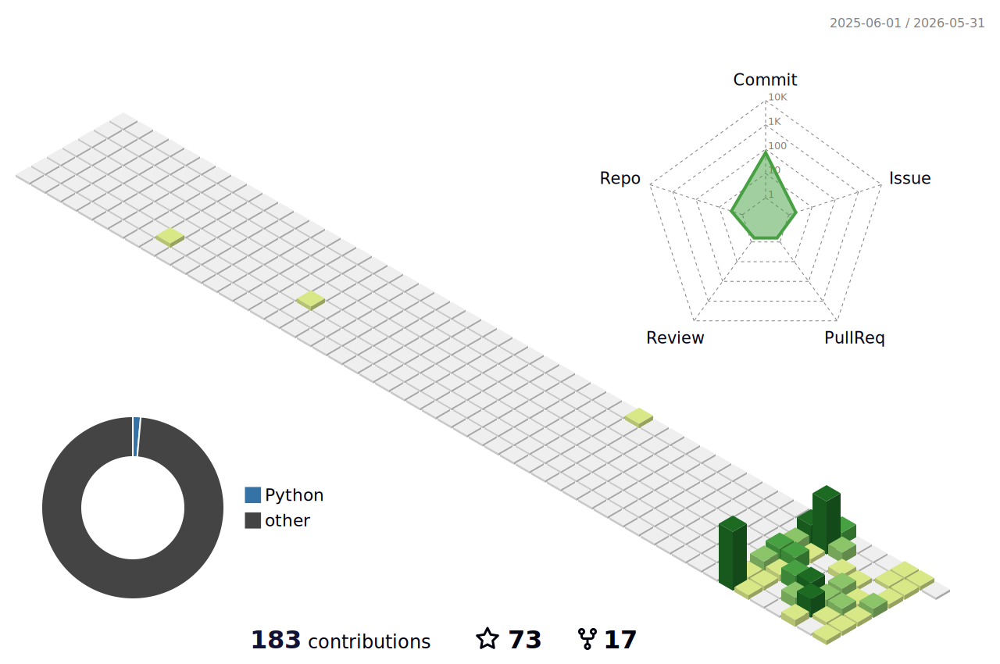

<p align="center">
  
</p>


<p align="center">
  
</p>


## 👩💻 About Me
- 🔭 Focus on **🌍 World Model & 🤖 Robotics & 🚗 Autonomous Driving** 
- ⚡ Fun fact: Hardware + Algorithm = My Passion

---

## 🛠 Tech Stack
<p align="center">
  <a href="https://skillicons.dev">
    
  </a>
</p>


---

## 📈 GitHub Stats

<p align="center">
  
  
</p>

<p align="center">
  
  
</p>

<p align="center">
  
  
</p>

## 🧩 Contribution Grid
<p align="center">
  
</p>

<p align="center">
  
</p>


## 🌤 Weather
<!--WEATHER_BLOCK_START-->
```
City           Weather      Temp   Wind   Humidity 
-------------- ------------ ------ ------ -------- 
Beijing        🌧         23°C  9km/h  89%      
Shanghai       🌙         24°C  15km/h 83%      
Wuxi           ☁️       24°C  15km/h 87%      
Philadelphia   🌤         27°C  5km/h  62%      
```
<!--WEATHER_BLOCK_END-->

## 🖥️ Dashboard
<!--DASHBOARD_START-->
```
🖥️ DEV TERMINAL
---------------
⚙️ System  Linux | 4 cores | 15Gi RAM | 39% 💾
🕒 Time (UTC) 2026-06-28 21:58

🌍 Time Zones
-------------
🇨🇳 Beijing 05:58
🇯🇵 Tokyo 06:58
🇺🇸 New York 17:58
🇬🇧 London 22:58

📊 Repo Stats
-------------
⭐ Commits    1
📝 Last      2 hours ago
🌿 Branch    main

🧠 Quote
--------
"Optimism is an occupational hazard of programming. 🚀"
```
<!--DASHBOARD_END-->

---

## 📚 Publications

🔗 [Google Scholar](https://scholar.google.com/citations?user=NXIYuY0AAAAJ&hl=en)

> Research Interests: Autonomous Driving · World Models · Video Generation · Diffusion Models · Efficient Inference

### 🌟 Selected Papers

* **Xiaomi EV World Model: A Joint World Model Integrating Reconstruction and Generation for Autonomous Driving**
  *arXiv, 2026*
  [[Paper]](https://arxiv.org/abs/2605.18137)

* **Toward Physically Consistent Driving Video World Models under Challenging Trajectories**
  *arXiv, 2026*
  [[Paper]](https://arxiv.org/abs/2603.24506)

* **Genesis: Multimodal Driving Scene Generation with Spatio-Temporal and Cross-Modal Consistency**
  *arXiv, 2025*
  [[Paper]](https://arxiv.org/abs/2506.07497)

* **WorldSplat: Gaussian-Centric Feed-Forward 4D Scene Generation for Autonomous Driving**
  *arXiv, 2025*
  [[Paper]](https://arxiv.org/abs/2509.23402)

* **Rethinking Driving World Model as Synthetic Data Generator for Perception Tasks**
  *arXiv, 2025*
  [[Paper]](https://arxiv.org/abs/2510.19195)

---

### 🧾 Full Publication List

<details>
<summary>Show all publications</summary>

#### 2026

* **Xiaomi EV World Model: A Joint World Model Integrating Reconstruction and Generation for Autonomous Driving**
  *arXiv, 2026*
  [[Paper]](https://arxiv.org/abs/2605.18137)

* **Toward Physically Consistent Driving Video World Models under Challenging Trajectories**
  *arXiv preprint*
  [[Paper]](https://arxiv.org/abs/2603.24506)

#### 2025

* **Genesis: Multimodal Driving Scene Generation with Spatio-Temporal and Cross-Modal Consistency**
  *arXiv preprint*
  [[Paper]](https://arxiv.org/abs/2506.07497)

* **WorldSplat: Gaussian-Centric Feed-Forward 4D Scene Generation for Autonomous Driving**
  *arXiv preprint*
  [[Paper]](https://arxiv.org/abs/2509.23402)

* **Rethinking Driving World Model as Synthetic Data Generator for Perception Tasks**
  *arXiv preprint*
  [[Paper]](https://arxiv.org/abs/2510.19195)

* **DriveMRP: Enhancing Vision-Language Models with Synthetic Motion Data for Motion Risk Prediction**
  *arXiv preprint*
  [[Paper]](https://arxiv.org/abs/2507.02948)

#### 2023

* **Research on Low Illumination Image Enhancement Algorithm and Its Application in Driver Monitoring System**
  *WCX SAE World Congress Experience*

#### 2022

* **Driver Lane Change Intention Recognition Based on Attention Enhanced Residual-MBi-LSTM Network**
  *IEEE Access*
  🏆 42 Citations

#### Others

* **Pipeline for Fast Digital Twin Development and Integration in Driving Simulation**

</details>

---
